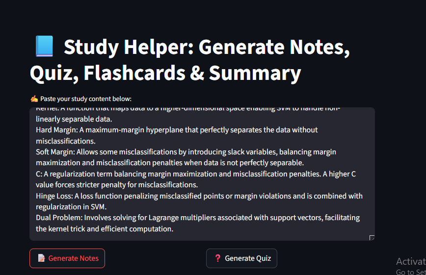

# Study Generator App

An AI-powered educational tool designed to assist students and lifelong learners by automatically generating study materials from any input text. Using advanced language models via LangChain and Groq’s LLaMA3, this app produces concise notes, quiz questions, flashcards, and summaries — all tailored to enhance learning efficiency and retention.

---

## Features

- **Notes Generation**: Automatically generate clear and concise notes to simplify complex topics.
- **Quiz Creation**: Generate relevant question-answer pairs for active recall and self-testing.
- **Flashcards Extraction**: Extract key terms and definitions formatted as flashcards for quick review.
- **Summarization**: Produce brief overviews highlighting the main ideas from the text.
- **Parallel Processing**: Uses LangChain’s `RunnableParallel` to run multiple tasks concurrently, improving speed and efficiency.
- **Pydantic Validation**: Ensures structured and consistent output formatting for flashcards.
- **Streamlit Interface**: Interactive web app allowing users to generate study materials with simple button clicks.
- **Customizable**: Easily adaptable prompts and models for different domains or languages.

---

## Technologies Used

- **LangChain**: For building composable language model chains and parsers.
- **Groq API**: Access to powerful LLaMA3-70B language model.
- **Pydantic**: For data validation and structured output parsing.
- **Streamlit**: For building an intuitive and interactive user interface.
- **Python**: Core programming language for logic and orchestration.

---

## Installation & Setup

1. **Clone the repository:**

   ```bash
   git clone https://github.com/codevizit/study-generator-app.git
   cd study-generator-app
--- 
### How It Works
- The input text is sent to multiple prompt chains running in parallel:

- Notes chain summarizes and simplifies the text.

- Quiz chain generates relevant Q&A pairs.

- Flashcards chain extracts key concepts validated by Pydantic models.

- Summary chain creates a concise overview.

- The results are merged and presented in a clean format.

- Streamlit manages the user interface and interaction, allowing real-time generation with a few clicks.



